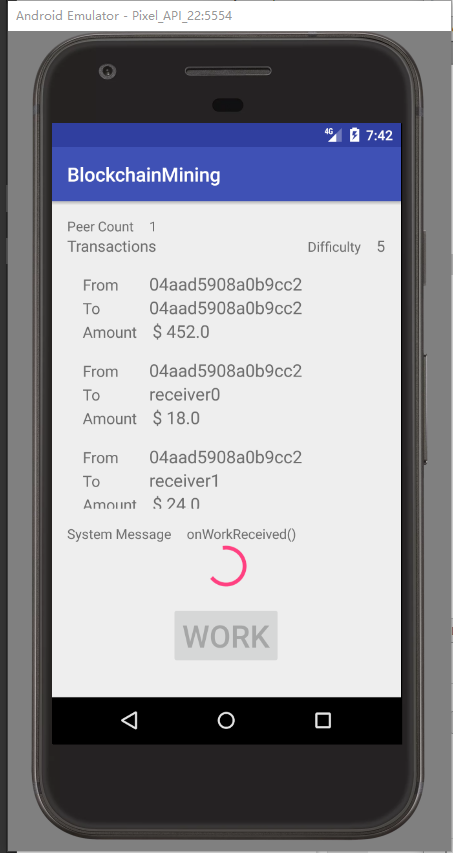
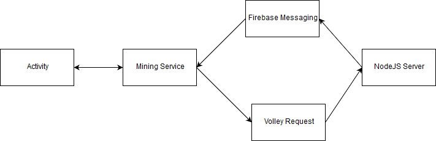

# Distributed Mining System

## Description
This is a simplified solution for [BMW Android Coding Challenge](https://github.com/BMWGroupTechnologyOfficeUSA/dli-coding-challenge/tree/master/android).

The solution create a central web service that delegates and aggregates the work to the client, and use android application as the client side to do the hard work, solving the puzzle.

The solution contains the server side, which implemented with NodeJS, and client side, which implemented with Android.

## Server Side Implementation
Server side implemented with NodeJS. It uses express to provide the web-service, and uses gcm to push message back to the clients.
The server deployed in the heroku here [https://shun-gao-blockchain.herokuapp.com](https://shun-gao-blockchain.herokuapp.com).

Server provides the following end points:

```/blocks``` - returns a list of the blocks which maintains all the server side transactions.

```/work``` - returns a JSON-encoded job that the client shall use to begin mining. Server will generate some dummy transactions if server doesn't have any pending transaction yet.
* Request body

```json
{
	"clientId":"eO-7XWW3pws:APA91bHzEJQjHbeRU60DU2BAQjCpuP9ef7R0HIox2xaBS5lAFxZiOZyFu02hOH36RqB99m7Z4NeDSZhyAOFVXp7WuEJbnJ_VUY4J8vAo-BtUiUC08Kq1ivqH9bA66geqOMsC25qHw1mX"
}
```

* Response
<details>
<summary>Block details</summary>

```json
{
    "jobId": 1,
    "clientId": "eO-7XWW3pws:APA91bHzEJQjHbeRU60DU2BAQjCpuP9ef7R0HIox2xaBS5lAFxZiOZyFu02hOH36RqB99m7Z4NeDSZhyAOFVXp7WuEJbnJ_VUY4J8vAo-BtUiUC08Kq1ivqH9bA66geqOMsC25qHw1mX",
    "block": {
        "timestamp": 1519873776344,
        "lastHash": "00000000000000000000000000000000",
        "hash": "",
        "data": [
            {
                "id": "f8e6f7b1-1cfd-11e8-a70d-b103292f9559",
                "blockHeader": {
                    "timestamp": 1519873776319,
                    "amount": 500,
                    "address": "0483baccaa4be91fd7dcbe97218282a80708d05d560f55d6c650e84f235c10157a5d2a31e8d406d8fa420ad1bc468daec8836fc034b9c0b4e72456b8f94de134f0",
                    "signature": {
                        "r": "9f8b6a1d6811403aae063a542fadc41a206c9aaf53adac72d9d29a29985cf204",
                        "s": "684a14667c7c3840b59c7d28bd5ab6b274892a7c12bee176c3d330d53d4fd33f",
                        "recoveryParam": 0
                    }

                },
                "transactions": [
                    {
                        "amount": 451,
                        "address": "0483baccaa4be91fd7dcbe97218282a80708d05d560f55d6c650e84f235c10157a5d2a31e8d406d8fa420ad1bc468daec8836fc034b9c0b4e72456b8f94de134f0"
                    },
                    {
                        "amount": 38,
                        "address": "receiver0"
                    },
                    {
                        "amount": 9,
                        "address": "receiver1"
                    },
                    {
                        "amount": 2,
                        "address": "receiver2"
                    }
                ]
            },
            {
                "id": "f8ed1230-1cfd-11e8-a70d-b103292f9559",
                "blockHeader": {
                    "timestamp": 1519873776339,
                    "amount": 500,
                    "address": "04a2d63980688b80d71c27b609f33a7cba44d76fe06fa6558089aa330b7a3fc576f95d7708b2c41091e6ae383f786ec3d30d2867d51dc74ae49ee53f7070889417",
                    "signature": {
                        "r": "d15e515d9ad77a365260efee5ccd8053a05940f71cc518fb5626e49c08c9fd40",
                        "s": "b6aef7fc8a5f867b12d7d46582f03fa1df1065715a6339ba5c29eac58bae44ca",
                        "recoveryParam": 1
                    }
                },
                "transactions": [
                    {
                        "amount": 50,
                        "address": "0483baccaa4be91fd7dcbe97218282a80708d05d560f55d6c650e84f235c10157a5d2a31e8d406d8fa420ad1bc468daec8836fc034b9c0b4e72456b8f94de134f0"
                    }
                ]
            }
        ],
        "nonce": 0,
        "difficulty": 5
    }
}
```

</details>

```/submit``` - post the hard work result to server and server will verify the nonce calculated by the client.

* Request Body

```json
{
	"jobId":12,
	"nonce":998422
}
```

* Response

```json
{
    "jobId": 1,
    "succeed": true
}
```

This was my first time using blockchain. It took me about 2 days to get to understand what blockchain is, and later implemented a simple server for transactions with blockchain. The following were materials that helped me better understand blockchain
* [Blockchain 101 - A Visual Demo](https://www.youtube.com/watch?v=_160oMzblY8)
* [Build a Blockchain and a Cryptocurrency from Scratch](https://www.udemy.com/build-blockchain/learn/v4/overview)

Since this is not a Node.js positon, I will not go too deep to explain my Node.js implementation.

## Client Side Implementation
Since this coding challenge is for android developers, I utilized the following android features
* aidl - android component communication (IPC)
* volley - for http web request
* firebase message - receiving server side notification

### Screenshot


The UI provides the following information:
* How many peers are working with this puzzle.
* Transactions associated with this block.
* Puzzle difficulty.
* System message.

And a button for user to request for a work.

### Client Side Design and Implementation
There are 4 components for the client side implementation.
* Mining Activity - Update the UI based on the mining status.
* Mining Service - Receive command from activity, make request to the server, and handle server side notifications.
* Mining Firebase Messaging Service - Monitor server side message and dispatch to Mining Service.
* Volley Requests - Do the actual http request to the server and post the result to Mining Server.



There is a little bit design for request classes. In order to reuse the code for making different request, we have a base JsonRequest and 2 sub-classes as WorkRequest and SubmitRequest. Each concrete sub-classes have to provide all the request details including all the request parameters, and can handle the responses by themselves. Please refer to the code for further details. So for the use of making web requests, it can be as simple as:

```java
StringRequest request = new WorkRequest().setClientId(clientId)
        .setWorkRequestListener(new WorkRequest.WorkRequestListener() {
            @Override
            public void onRequestReceived(int jobId, Block block) {
                Logger.v(TAG, "onRequestReceived() jobId: " + jobId + ", block: " + block);
                onWorkReceived(jobId, block);
            }

            @Override
            public void onError(int errorCode) {
                Logger.e(TAG, "onError() " + errorCode);
            }
        }).getRequest();
JsonRequest.printRequest(request);
request.setRetryPolicy(DEFAULT_RETRY_POLICY);
requestQueue.add(request);
```

## Submission
As required, this repository including the following contents
* A README.md with a description of the problem and your solution.
* All source code. Package the source files into a zip archive or provide a link to a hosted repository for example on GitHub.
* A link to the server application that is live and functional.  [https://shun-gao-blockchain.herokuapp.com](https://shun-gao-blockchain.herokuapp.com).

## Supplement

### Defect
Due to the limited time I was allowed to work on this project aside with a full-time job, there are definitely much more to be complete. The following are problems that are not yet completed
* I didn't complete the Extensions list in the coding challenge. 
* In the challenge overview, 'Use an appropriate authentication mechanism' was cofusing to me. So it wasn't implemented. I believe implementation can be done if more details are available.

### Improvement
The following improvement can be done for this challenge
* Use native code to do the hard work.
* Add subscribe functionality, which server can trigger all the connected devices to do the hard work.

### Total Work Hours - 40 hrs
* Learn what is blockchain and implement a simple server provide transactions - 16 hrs
* Server side implementation for work/submit - 4 hrs
* Server side gcm message - 2 hrs
* Client side gcm implementation - 2 hrs
* Client side request implementation - 4 hrs
* Client side Mining Service - 4 hrs
* Client side UI implementation - 2 hrs
* README file - 4 hrs
* Other - 2 hrs